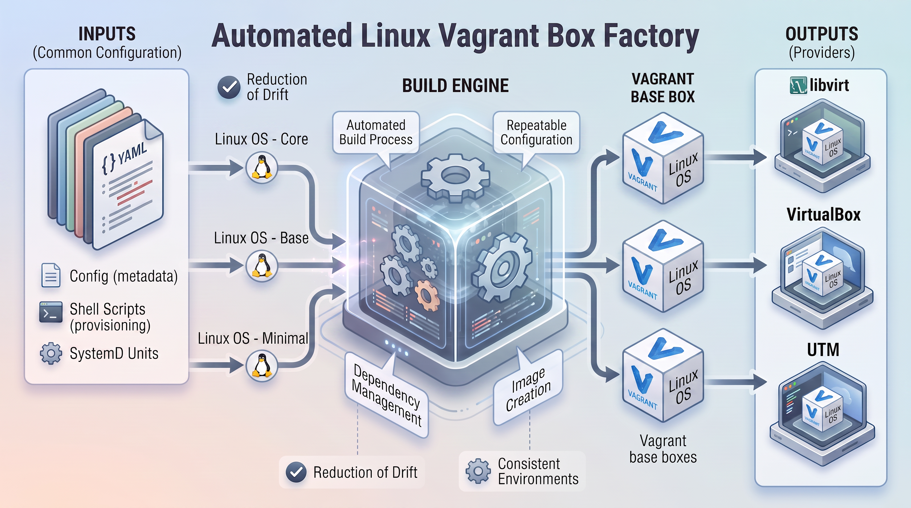

# Vagrant boxes

<!-- markdown-link-check-disable-next-line -->

<!-- markdown-link-check-disable-next-line -->

This repository provides the automated build system for producing and publishing Vagrant base boxes across multiple virtualization providers, including `libvirt`, `VirtualBox`, and `UTM`.

These boxes serve as a reliable, standardized foundation for local development, testing, and infrastructure workflows. By building the images from version-controlled templates and a consistent provisioning process, the project ensures that environments can be recreated predictably across machines and providers, reducing configuration drift and the time required to bootstrap a new environment.

The project intentionally maintains a focused set of supported Ubuntu releases:

- [Ubuntu 22.04](https://portal.cloud.hashicorp.com/vagrant/discover/electrocucaracha-boxes/ubuntu-jammy)
- [Ubuntu 24.04](https://portal.cloud.hashicorp.com/vagrant/discover/electrocucaracha-boxes/ubuntu-noble)
- [Ubuntu 26.04](https://portal.cloud.hashicorp.com/vagrant/discover/electrocucaracha-boxes/ubuntu-resolute)

## Reasons to Use these Vagrant boxes

These Vagrant boxes provide a consistent, reliable, and maintainable foundation for development, CI environments, and infrastructure testing. By starting with well-maintained base images, teams can avoid repeatedly configuring and maintaining the underlying operating system for each environment.

This project centralizes the creation and maintenance of the base boxes through a repeatable and auditable build process. Operating system configuration, provisioning, cleanup, and packaging are defined and managed in one place, allowing changes to be applied consistently across newly published boxes.

Using these boxes helps teams:

- **Reproducible environments:** Version-controlled templates and provisioning scripts allow boxes to be rebuilt consistently, making the resulting environments predictable and easier to troubleshoot.
- **Consistent developer experience:** The same operating-system configuration, users, networking behavior, cleanup procedures, and packaging conventions are applied across supported providers.
Multi-provider support: A common build process produces provider-specific artifacts for libvirt, VirtualBox, and UTM, allowing teams to use the virtualization platform that best fits their workstation or workflow.
- **Ready-to-use artifacts:** Builds produce complete Vagrant distributions, including .box files, checksums, and metadata.json, making the resulting images immediately consumable by Vagrant.
- **Faster environment provisioning:** Consumers can start from a prebuilt and consistently configured Ubuntu environment instead of repeatedly installing and configuring the operating system from scratch.
- **Reduced configuration drift:** Centralizing the base-image configuration helps ensure that different developers and environments start from the same known foundation.
Simplified maintenance: Updates to the base operating system or provisioning process can be incorporated centrally and distributed through new box releases rather than requiring every consumer to maintain their own base image.
- **Focused support matrix:** The project deliberately maintains a small set of Ubuntu releases and providers, keeping the build, validation, and publishing surface manageable while providing coverage for the most relevant environments.
- **Flexible distribution:** Published artifacts can be consumed directly from local file:// metadata or from a hosted base URL, supporting both local development and centralized distribution workflows.
